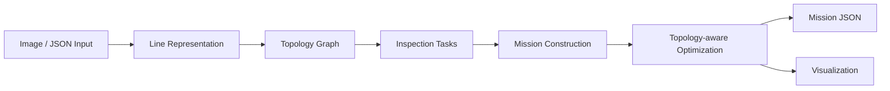

# UAV Powerline Inspection Mission Planner

A research prototype for **topology-aware UAV mission planning** in powerline inspection scenarios.

The project focuses on high-level mission planning: determining **which powerline segments to inspect, in what order, and how the UAV should move between inspection segments**.

> This project focuses on mission-level planning rather than low-level flight control, SLAM, or MPC.

---

## Overview

Powerline inspection can be modeled as a graph-based planning problem.

Given a representation of powerline infrastructure and inspection targets, the system constructs a topology graph, maps inspection tasks onto graph edges, and generates an ordered mission consisting of:

- `inspect` segments for required inspection tasks;
- `connect` segments for moving between inspection tasks.

The current prototype supports both image-based and structured JSON inputs.

```text
Input
  │
  ├── Powerline Image
  │
  └── Structured JSON
  │
  ▼
Line Representation
  │
  ▼
Topology Graph
  │
  ▼
Inspection Tasks
  │
  ▼
Mission Construction
  │
  ▼
Topology-aware Optimization
  │
  ▼
Mission JSON / Visualization
```

---

## Key Features

### Topology-aware Mission Planning

Powerline infrastructure is represented as a graph, allowing inspection tasks and transition paths to be planned according to network topology rather than only geometric distance.

### Graph-based Connection Planning

The planner supports different strategies for connecting inspection segments:

- **BFS** — minimizes the number of graph hops;
- **Dijkstra** — minimizes accumulated edge cost.

This makes it possible to study the difference between topological hop count and geometric/path cost.

### Unified Mission Representation

Inspection missions are represented as structured sequences of:

```text
inspect → connect → inspect → connect → ...
```

The resulting mission can be exported as JSON for further processing or visualization.

### Visualization

The system provides interactive and static visualization for:

- powerline topology;
- inspection targets;
- planned routes;
- mission segments;
- intermediate planning results.

---

## Demo

<p align="center">
  
</p>

The visualization illustrates the powerline topology, inspection targets, and the generated mission route.

---

## System Architecture



Main components:

| Component | Responsibility |
|---|---|
| `input/` | Structured input and adapters |
| `core/` | Topology and mission representations |
| `planner/` | Routing and mission planning |
| `visualization/` | Mission and topology visualization |
| `demo/` | Example workflows and experiments |
| `data/` | Example inputs |
| `docs/` | Additional documentation |

---

## Example Results

The following results are obtained from the example inputs included in this repository and are intended to illustrate planner behavior rather than serve as general performance benchmarks.

### Topology-aware Mission Ordering

For one example topology:

| Metric | Baseline | Optimized |
|---|---:|---:|
| Total path length | 1844.5 px | 1453.5 px |
| Connection length | 752.4 px | 361.4 px |
| Inspection length | 1092.1 px | 1092.1 px |

The inspection distance remains unchanged while the connection distance is reduced by approximately **52%** in this example.

The result illustrates how topology-aware mission ordering can reduce unnecessary movement between inspection segments without changing the required inspection coverage.

### BFS vs. Dijkstra

For an example connection-planning problem:

| Planner | Graph hops | Path cost |
|---|---:|---:|
| BFS | 2 | 1728.2 |
| Dijkstra | 4 | 1000.0 |

BFS finds a path with fewer graph hops, while Dijkstra finds a lower-cost path under the configured edge weights.

These experiments are illustrative examples and should not be interpreted as general performance benchmarks.

---

## Repository Structure

```text
.
├── core/               # Topology and mission representations
├── planner/            # Routing and mission planning
├── input/              # Structured input adapters
├── visualization/      # Visualization utilities
├── demo/               # Runnable examples
├── data/               # Example inputs
├── docs/               # Documentation
└── result/             # Generated outputs
```

Generated results under `result/` can be reproduced by running the corresponding demo scripts.

---

## Getting Started

### Installation

Clone the repository:

```bash
git clone https://github.com/Endless-endless/uav-inspection-planner.git
cd uav-inspection-planner
```

Install dependencies:

```bash
pip install -r requirements.txt
```

Python **3.9+** is recommended.

### Run the Image-based Pipeline

```bash
python demo/demo_visualization_main.py
```

This pipeline processes the example powerline image and generates mission planning and visualization results.

### Run the Structured Mission Pipeline

```bash
python demo/demo_unified_mission.py
```

This pipeline constructs a mission from structured input data.

### Run the BFS / Dijkstra Comparison

```bash
python demo/demo_dijkstra_contrast.py
```

This example compares hop-based BFS routing with cost-based Dijkstra routing.

Generated outputs are stored under:

```text
result/
```

---

## Input Representation

The project currently supports two types of input.

### Image-based Input

A powerline image is processed to construct a representation of the line network before topology and mission generation.

Example:

```text
data/test.png
```

### Structured Input

Structured JSON input can directly describe powerline infrastructure, inspection targets, and related mission information.

Example files include:

```text
data/sample_unified_input.json
data/sample_unified_topo_input.json
data/sample_dijkstra_contrast_input.json
```

Both input paths eventually share the topology and mission-planning components of the system.

---

## Planning Pipeline

At a high level, the system follows the pipeline:

```text
Powerline Representation
        │
        ▼
Topology Construction
        │
        ▼
Inspection Task Mapping
        │
        ▼
Mission Construction
        │
        ▼
Inspection Ordering
        │
        ▼
Connection Planning
        │
        ▼
Mission Output
```

A mission consists primarily of two types of segments:

```text
inspect
```

for traversing required inspection segments, and

```text
connect
```

for moving between inspection segments.

The optimization process attempts to reduce unnecessary connection cost while preserving the required inspection tasks.

---

## Routing Strategies

### BFS

Breadth-first search is used as a hop-based connection planner.

Its objective is approximately:

```text
minimize number of graph edges traversed
```

This does not necessarily correspond to the shortest geometric path.

### Dijkstra

Dijkstra's algorithm uses weighted graph edges.

Its objective is:

```text
minimize accumulated edge cost
```

Depending on the edge-weight definition, this can produce a route with more graph hops but lower total travel cost.

The comparison between BFS and Dijkstra is used to explore the effect of different routing objectives on mission construction.

---

## Outputs

The system can generate several forms of output.

### Mission JSON

Mission data includes information such as:

- inspection segments;
- connection segments;
- mission ordering;
- topology relationships;
- route information.

### Interactive Visualization

Interactive HTML visualizations can be generated using Plotly to inspect:

- powerline topology;
- inspection targets;
- planned mission paths;
- mission segments.

### Static Visualization

Static images can also be generated for intermediate pipeline results and route overlays.

---

## Project Status

This repository is currently an **experimental research prototype**.

Current work focuses on:

- topology-based inspection mission representation;
- graph-based routing;
- mission ordering and connection-cost reduction;
- structured mission input;
- mission visualization.

The project is intended primarily for experimentation with high-level UAV inspection mission planning.

---

## Future Work

Possible extensions include:

- geographic and GIS-based inputs;
- 3D topology and terrain-aware planning;
- UAV energy constraints;
- speed and motion constraints;
- weather-aware routing costs;
- multi-UAV mission allocation;
- integration with low-level trajectory planners;
- evaluation on larger and more realistic power-grid topologies.

---

## Scope and Limitations

This project addresses **high-level inspection mission planning**.

It does **not** currently implement:

- UAV flight control;
- SLAM;
- real-time obstacle avoidance;
- MPC-based trajectory tracking;
- autonomous flight execution;
- safety-critical deployment.

A complete autonomous UAV inspection system would require these components in addition to the mission-planning layer implemented here.

---

## Related Work

For low-level powerline tracking and MPC-based trajectory planning, see:

[uzh-rpg/pampc_for_power_line](https://github.com/uzh-rpg/pampc_for_power_line)

The two projects operate at different levels of the UAV inspection stack:

| This Repository | `pampc_for_power_line` |
|---|---|
| High-level mission planning | Low-level trajectory planning |
| Inspection task ordering | Powerline tracking |
| Graph-based routing | MPC-based execution |
| `inspect` / `connect` mission organization | Continuous UAV trajectory control |

Conceptually, the relationship can be viewed as:

```text
Mission Planning
      │
      │  inspection targets / route
      ▼
Trajectory Planning
      │
      ▼
Flight Control
```

This repository primarily focuses on the first layer.

---

## Author

**Zhijing Wu**

Computer Science  
Sichuan University

GitHub: [@Endless-endless](https://github.com/Endless-endless)

---

## License

License information will be added as the project is prepared for public release.