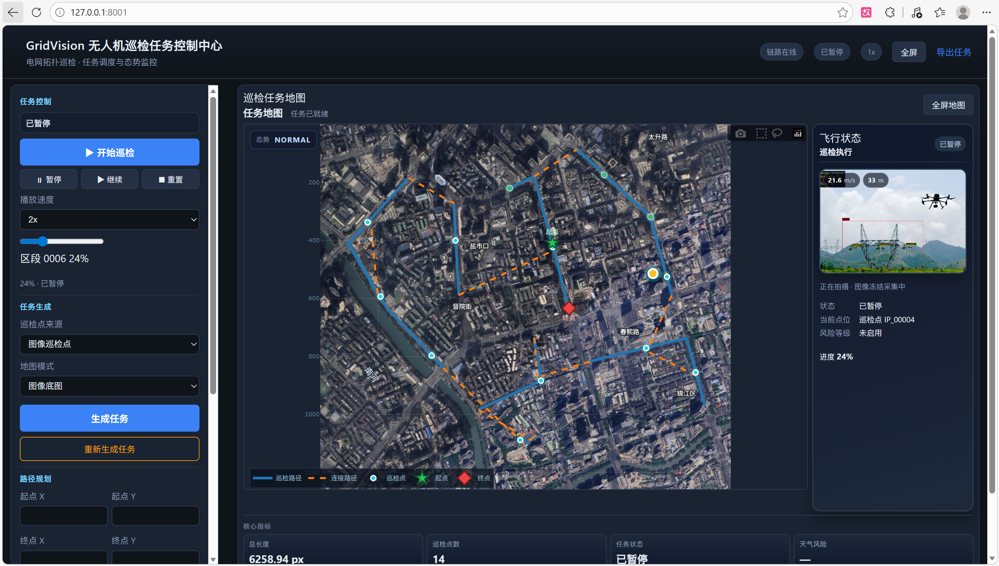
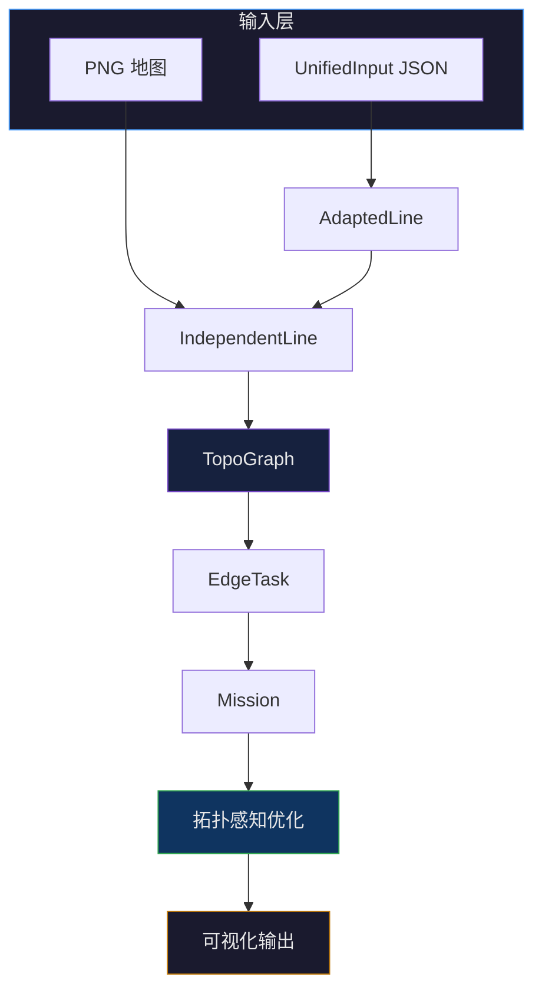

<div align="center">

# ⚡ UAV 输电线路巡检任务规划系统

**UAV Powerline Mission Planning System**

*面向输电线路巡检场景的拓扑感知 UAV 任务规划*

[](requirements.txt)
[](README.md)
[](README.md)
[](README.md)
[](core/topo.py)
[](planner/topo_dijkstra.py)
[](README.md)

`任务规划` · `拓扑优化` · `Dijkstra 路由` · `UnifiedInput 管线`

*高层巡检任务规划 — 非飞控 / 非 MPC 执行栈*

</div>

---

## 目录

- [项目概览](#项目概览)
- [项目亮点](#项目亮点)
- [演示预览](#-演示预览)
- [系统架构](#-系统架构)
- [功能特性](#-功能特性)
- [目录结构](#-目录结构)
- [快速开始](#-快速开始)
- [实验结果](#-实验结果)
- [可视化与输出](#️-可视化与输出)
- [后续路线](#️-后续路线)
- [免责声明](#免责声明)
- [参考与致谢](#参考与致谢)

---

## 项目概览

本仓库是一个 **UAV 输电线路巡检任务规划** 研究原型，在电网拓扑模型上组织：*巡检什么*、*以何种顺序*、*如何在区段间转移*。

| | 范围内 | 范围外 |
|---|--------|--------|
| **定位** | 任务规划、拓扑图、inspect/connect 区段 | 飞控、MPC、SLAM |
| **产出** | Mission JSON、拓扑感知路径、HTML 可视化 | 实时自驾、适航认证 |

**双输入管线**（共享同一任务栈）：

| 管线 | 输入 | 入口 |
|------|------|------|
| 图像主线 | `data/test.png` | `demo/demo_visualization_main.py` |
| Unified 主线 | `data/sample_*.json` | `demo/demo_unified_mission.py` |

---

## 项目亮点

| 能力 | 说明 |
|------|------|
| **UnifiedInput 管线** | 结构化 JSON（线路、杆塔、气象、UAV）→ 任务，无需栅格提取 |
| **拓扑感知任务优化** | 基于 `TopoGraph` 的边访问顺序与 connect 区段规划 |
| **Dijkstra 连接规划** | 代价最小路径 vs. 跳数最小 BFS（`connect_planner`: `bfs` \| `dijkstra`） |
| **结构化巡检工作流** | `EdgeTask` → 分组 `inspect` / `connect` → 可导出 Mission JSON |

---

## 📸 演示预览

> 以下为占位图；运行 demo 后可将截图放入 `media/` 目录。

<p align="center">
  
  
</p>

<p align="center">
  <sub>左：图像主线（<code>demo_visualization_main.py</code>）· 右：Unified 任务（<code>demo_unified_mission_visualization.py</code>）</sub>
</p>

---

## 🧠 系统架构



**线性视图**

```
PNG / JSON  →  UnifiedInput / AdaptedLine  →  IndependentLine
      →  TopoGraph  →  EdgeTask  →  Mission
      →  Optimization  →  Visualization（JSON · HTML · PNG）
```

| 层级 | 职责 | 主要模块 |
|------|------|----------|
| 输入层 | JSON 校验或 PNG 线路提取 | `input/`, `planner/powerline_planner_v3_final.py` |
| 拓扑层 | 节点、边、合并/切分 | `core/topo.py` |
| 任务层 | 巡检点映射到拓扑边 | `core/topo_task.py`, `input/unified_task_adapter.py` |
| 规划层 | 分组、inspect/connect、导出 | `core/topo_plan.py` |
| 优化层 | 访问顺序、图上 connect | `planner/mission_optimizer.py`, `core/topo_global_optimizer.py` |
| 连接规划 | BFS（跳数）vs. Dijkstra（代价） | `planner/topo_dijkstra.py` |
| 输出层 | Mission JSON、Plotly、叠加图 | `visualization/`, `demo/generate_interactive_main_view.py` |

---

## ✨ 功能特性

<details open>
<summary><b>核心管线</b></summary>

- **图像主线** — PNG → 提取 → 骨架 → 独立线路 → 拓扑 → 任务  
- **UnifiedInput 主线** — JSON 元数据 → 适配线路 → 共享拓扑栈  
- **TopoGraph** — 节点合并/切分、边分解、邻接关系  
- **EdgeTask** — 巡检点映射到拓扑边  
- **Mission 生成** — 分组区段、访问顺序、JSON 导出  

</details>

<details open>
<summary><b>规划与路由</b></summary>

- **拓扑感知优化** — 基于图的边序与 connect 区段  
- **BFS / Dijkstra** — 跳数最小 vs. 边权代价最小  
- **任务分析** — 基线 vs. 优化指标（`demo_mission_compare.py`）  

</details>

<details>
<summary><b>可视化</b></summary>

- Plotly 交互式 HTML（`result/latest/`, `result/unified_mission/`）  
- 基于 `data/test.png` 的 2D 地图叠加  
- 管线调试分步 PNG（`result/steps/`）  

</details>

---

## 📂 目录结构

```
.
├── core/                 # TopoGraph、EdgeTask、topo_plan、全局优化
├── planner/              # 图像规划器、Dijkstra、mission_optimizer
├── input/                # UnifiedInput 模式与适配器
├── demo/                 # 图像 / Unified / Dijkstra 入口
├── visualization/        # Plotly、地图叠加、matplotlib
├── weather/              # 风况配置（图像主线）
├── data/                 # test.png、sample_*.json
├── result/               # 运行输出（gitignore）
│   ├── latest/           # 图像主线
│   ├── unified_mission/
│   ├── dijkstra_test/
│   └── steps/
├── docs/                 # 设计与 JSON 说明
├── archive/              # 已弃用模块（如 deprecated_20260519/）
└── media/demos/          # 本地演示录像（gitignore）
```

`result/` 及生成物默认不纳入版本库，重新运行 demo 即可生成。目录整理说明见 `CLEANUP_PLAN.md`。

---

## 🚀 快速开始

### 安装

```bash
git clone <repository-url>
cd <project-root>
pip install -r requirements.txt
```

**Python 3.9+** · `numpy`, `scipy`, `Pillow`, `scikit-image`, `scikit-learn`, `matplotlib`, `plotly`

**输入文件**

```text
data/test.png
data/sample_unified_input.json
data/sample_unified_topo_input.json
data/sample_dijkstra_contrast_input.json
```

### 运行

<table>
<tr><th>轨道</th><th>命令</th><th>输出</th></tr>
<tr>
  <td><b>A · 图像主线</b></td>
  <td><code>python demo/demo_visualization_main.py</code></td>
  <td><code>result/latest/mission_output.json</code>、<code>main_view_interactive.html</code></td>
</tr>
<tr>
  <td><b>B · Unified</b></td>
  <td><code>python demo/demo_unified_mission.py</code><br/>
      <code>python demo/demo_mission_compare.py</code></td>
  <td><code>result/unified_mission/</code></td>
</tr>
<tr>
  <td><b>C · Dijkstra</b></td>
  <td><code>python demo/demo_dijkstra_contrast.py</code></td>
  <td><code>result/dijkstra_test/dijkstra_contrast.json</code></td>
</tr>
</table>

<details>
<summary>更多命令</summary>

```bash
# Unified — 分步
python demo/demo_unified_input.py
python demo/demo_unified_topo_bridge.py
python demo/demo_unified_edge_tasks.py

# Unified — 可视化
python demo/demo_unified_mission_visualization.py

# 图像 — 导航 UI（可选）
python demo/demo_ui_animation.py

# Dijkstra — 扩展对比
python demo/demo_dijkstra_topo_compare.py
python demo/demo_mission_bfs_vs_dijkstra.py
python demo/demo_dijkstra_visualization.py
```

</details>

---

## 🧪 实验结果

> 以下数据来自仓库内置样例，仅作行为说明，**非**普适性能基准。

### 拓扑感知优化

**配置：** `data/sample_unified_topo_input.json` · `demo/demo_mission_compare.py` · 结果：`result/unified_mission/mission_compare.json`

| 指标 | 基线 | 优化后 | 变化 |
|:-----|-----:|-------:|-----:|
| 总长度 (px) | 1844.5 | 1453.5 | **−21.2%** |
| 连接长度 (px) | 752.4 | 361.4 | **−52.0%** |
| **连接占比 connect_ratio** | **0.408** | **0.249** | **−39.1%**（相对） |
| 巡检长度 (px) | 1092.1 | 1092.1 | 0% |

巡检覆盖不变；通过拓扑感知的边序重排降低 connect 开销。

### Dijkstra vs. BFS（连接路径）

**配置：** `data/sample_dijkstra_contrast_input.json` · `demo/demo_dijkstra_contrast.py`

| 规划器 | 优化目标 | 跳数 | 路径代价 (2D px) | 说明 |
|:-------|:---------|-----:|-----------------:|:-----|
| **BFS** | 最少跳数 | 2 | 1728.2 | 跳数少，几何路径更长 |
| **Dijkstra** | 最小边权 | 4 | 1000.0 | 路径代价约低 **42%**，跳数更多 |

任务构建可在 `core/topo_global_optimizer.py` 中配置 `connect_planner`: `bfs` | `dijkstra`。

---

## 🛰️ 可视化与输出

| 产物 | 位置 | 内容 |
|------|------|------|
| Mission JSON | `result/latest/`, `result/unified_mission/` | 分组、`inspect`/`connect` 区段、访问顺序 |
| Plotly HTML | `main_view_interactive.html`, `unified_mission_view.html` | 地图、路径、巡检点 |
| 2D 叠加图 | `result/latest/map_overlay_*.png` | 路径叠加于 `data/test.png` |
| 分析 JSON | `mission_compare.json`, `dijkstra_contrast.json` | 优化与路由指标 |

JSON 字段说明：[`docs/MISSION_JSON_AND_UI_FEATURES.md`](docs/MISSION_JSON_AND_UI_FEATURES.md)

---

## 🛣️ 后续路线

| 方向 | 状态 |
|------|------|
| 气象感知连接代价 | 规划中 |
| 三维拓扑与地形感知区段 | 规划中 |
| GIS / 地理坐标输入 | 规划中 |
| [pampc](https://github.com/uzh-rpg/pampc_for_power_line) 任务导出对接 | 规划中 |
| UAV 约束（电量、速度等） | 规划中 |
| UnifiedInput Web 看板 | 规划中 |

---

## 免责声明

本项目面向电网拓扑上的 **高层任务规划与航线组织**，**不是** 实时飞控、自动驾驶或现场级安全认证系统。实际部署须另行完成验证与合规流程。

---

## 参考与致谢

**底层巡线跟踪：** [uzh-rpg/pampc_for_power_line](https://github.com/uzh-rpg/pampc_for_power_line)

| 层级 | 本仓库 | pampc |
|------|--------|-------|
| 范围 | 任务结构、拓扑图、inspect/connect 编排 | 跟踪、MPC、执行层规划 |
| 分工 | *巡检哪些线、顺序如何、网上如何衔接* | *沿线路如何飞行* |

**延伸阅读**

| 文档 | 内容 |
|------|------|
| [`README_CURRENT_FLOW.md`](README_CURRENT_FLOW.md) | 图像主线分步说明 |
| [`PROJECT_STRUCTURE.md`](PROJECT_STRUCTURE.md) | 模块结构（部分略旧） |
| [`docs/`](docs/) | JSON 格式、诊断说明 |

---

## 许可证

公开发布时请补充许可条款（如 MIT、仅限研究使用等）。
